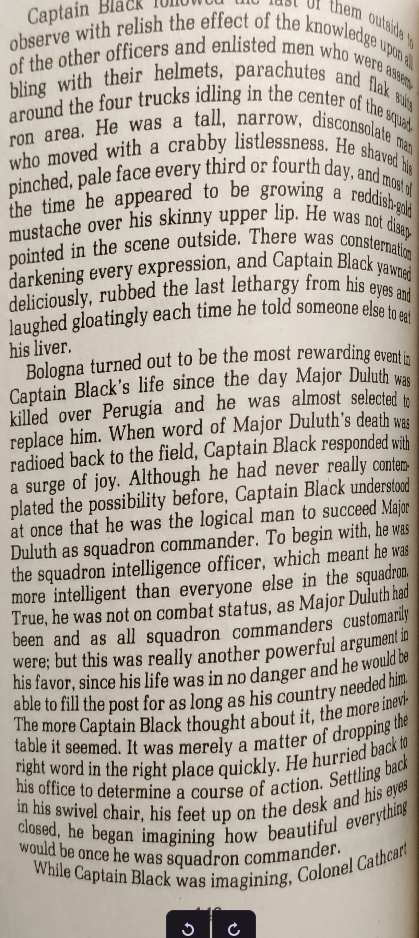
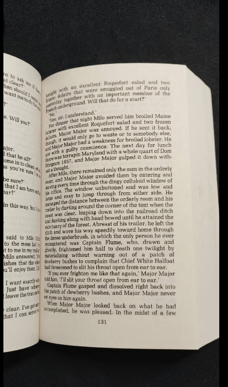
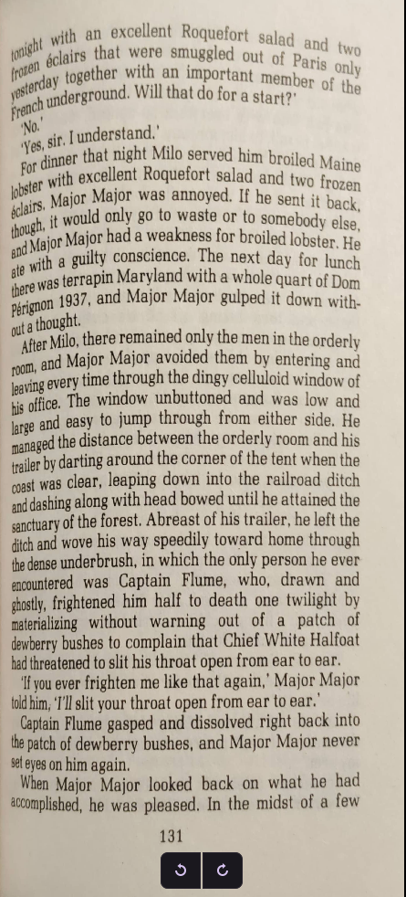

# Page Scan/Straightening Tool

A simple python tool by jtrebicki

## Introduction

Owning some more rare manga/comic books, and reading how those are normally scanned in (destroying the original medium, getting all the pages out), I thought, why just not take images and maybe edit and straighten them a bit? Taking pictures will have the pictures contain slated text/pages. This tool aims to help make these images look a bit better for compilation in a PDF or similiar.

I admit the results probably will not look perfect, also depends on how you take the images. I took two quick snaps of a book I had laying around to test this out, its passable.

This is a half a year old project of mine and I'm not really a computer vision expert, I just thought it might help someone.

## Use

Put all your images (preferably in order) in the folder with the main python file.

Run

```
python3 transformImages.py
```

Click the four corners of your page in the following order: Left top, right top, right bottom, left bottom

(The points in the following image are not optimally placed; they are there to show the user interface. You have to experiment with the right positioning of the corners. From further testing, on the below page, I would place the top left point further down right, the bottom right more up and the bottom left more up and left!)


That part of the image gets taken and the perspective transformed and saved.

Then it will go on to the next image til all images are moved to the "used" folder.

You can find all outputs in the "done" folder, and all source images will be moved to the "used" folder.

## Results

### Input image 1:


### Output Image 1:



### 

### Input Image 2:



### Output Image 2:



## Requirements

Use Python 3

Also see requirements.txt

```
opencv-python
numpy
```

